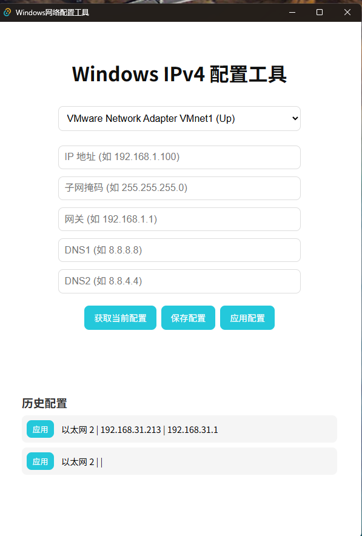
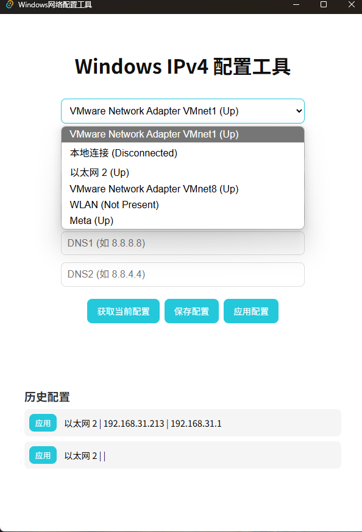

# tauri-vue-20250419

[](LICENSE)
[](#)
[](#)

> 获取 Windows 系统网络适配器的 IPv4 地址并支持一键修改！

---

## 📖 目录
- [项目简介](#项目简介)
- [主要特性](#主要特性)
- [效果展示](#效果展示)
- [开发文档](#开发文档)
- [打包说明](#打包说明)

---

## 项目简介
本项目基于 [Tauri](https://tauri.app/) + [Vue3](https://vuejs.org/) 技术栈开发，旨在提供一个简单易用的 Windows 网络适配器 IPv4 配置工具。用户可通过图形界面查看、修改本机网络适配器的 IPv4 地址、子网掩码、网关及 DNS，并支持配置历史记录。

- 前端：Vue 3 + Vite，现代化界面体验
- 后端/桌面容器：Tauri（Rust），安全高效，最终打包为原生 Windows 应用

## 主要特性
- 🚀 一键获取/修改网络适配器 IPv4 配置
- 🛡️ 安全设计，最小权限原则
- 📝 配置历史记录，支持一键切换
- 💡 友好的异常处理与状态提示
- 🌐 架构兼容多平台（当前以 Windows 为主）

## 效果展示





## 开发文档
- [开发文档（中文）](./WindowsNetworkConfigTool_DevDoc_CN.md)
- [Developer Doc (English)](./WindowsNetworkConfigTool_DevDoc_EN.md)

### 结构简览
```
├── src/              # 前端 Vue3 源码
│   ├── App.vue       # 主界面与核心逻辑
│   └── main.ts       # 入口文件
├── src-tauri/        # Tauri 后端（Rust）相关
│   └── tauri.conf.json # Tauri 配置
├── public/           # 静态资源
├── dist/             # 前端打包输出
├── package.json      # 前端依赖与脚本
├── vite.config.ts    # Vite 配置
```

## 打包说明
详细打包方法请见：[打包说明.md](./打包说明.md)

### 快速打包（64位推荐）
```shell
# 构建前端
yarn build
# 构建后端
cd src-tauri
cargo build --release
cd ..
```
生成的可执行文件位于：`src-tauri/target/release/tauri-vue-20250419.exe`

---

如需更多开发细节、API 调用方式等请查阅开发文档。

